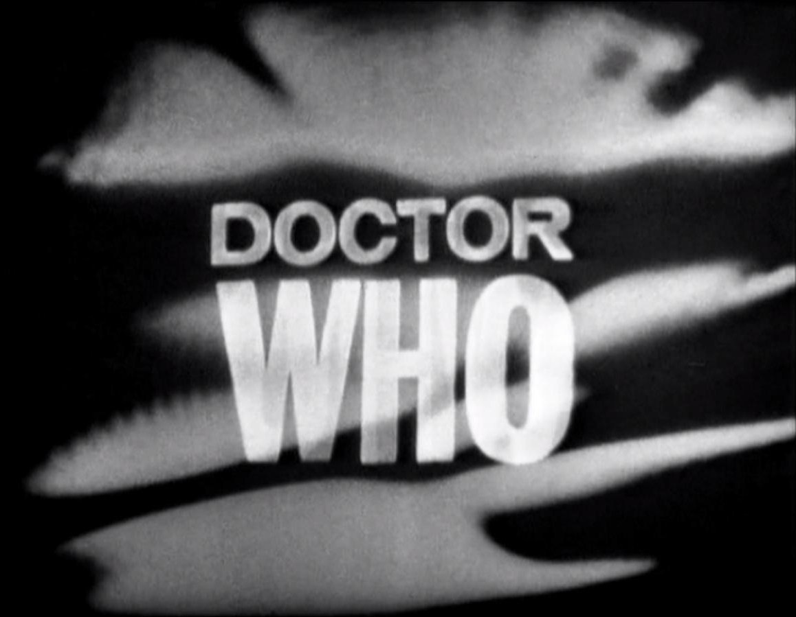

# [fit] 50 years
# [fit] in 10 minutes

^ eagle nerd badge

---

# [fit] BBC TV show
## [fit] running since 1963
## [fit] about an alien who travels in...

^ The theme music is most famous TV theme.

---

# [fit] The TARDIS
# [fit] a time machine
# [fit] that looks like a
# [fit] police box

^ It's bigger on the inside.

---

# [fit] Enemies:
# [fit] The Master, cybermen, autons,
# [fit] his fellow Time Lords

---

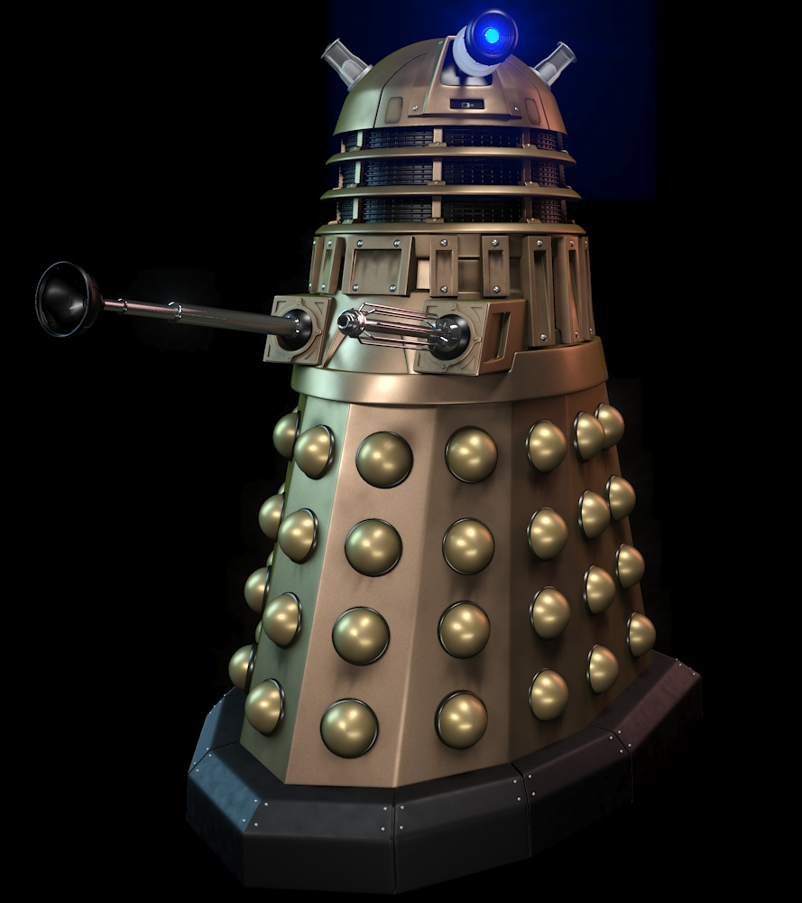

# [fit] Daleks
# [fit] "Exterminate!"

^ The Doctor's #1 most famous enemy. Toilet plunger!

---

# [fit] The Doctor is a
# [fit] trickster

^ Lies, manipulates, sometimes does horrible things for greater good.

---

# [fit] The Doctor
# [fit] has no name
# [fit] \(that we know)

^ The title of the show is a question: Who is he? Alien, two hearts, on the run with a stolen tardis, but why?

---

# [fit] The Doctor
# [fit] regenerates

^ This allows the series to change actors. 13 through the series.

---

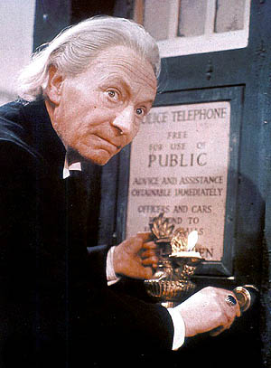
# [fit] One
# [fit] William Hartnell
# [fit] 1963-1966
# [fit] "grandfather"

^ Traveled with his granddaughter as Companion. Was the grumpiest & most irascible of all the Doctors.

---

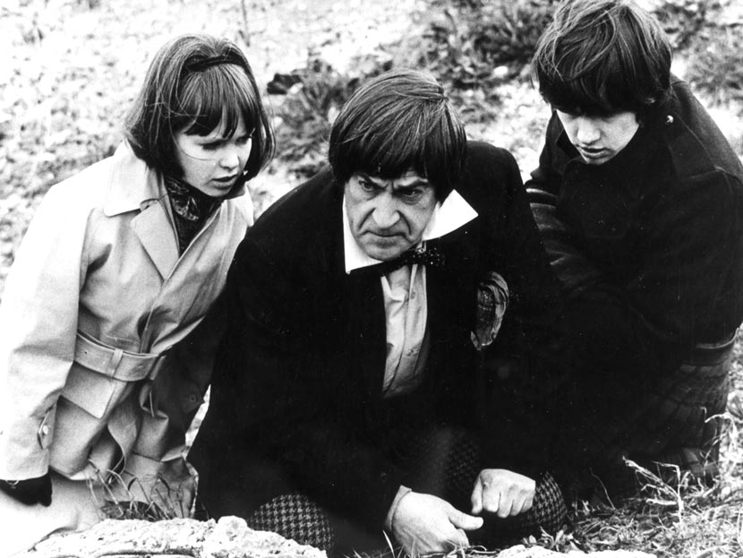
# [fit] Two
# [fit] Patrick Troughton
# [fit] 1966 - 1969
# [fit] the cosmic hobo
# [fit] "When I say run, run!"

^ Most famous companion was Jamie, a Scots boy in a kilt. My personal favorite. Most of his episodes were toasted by the BBC.

---

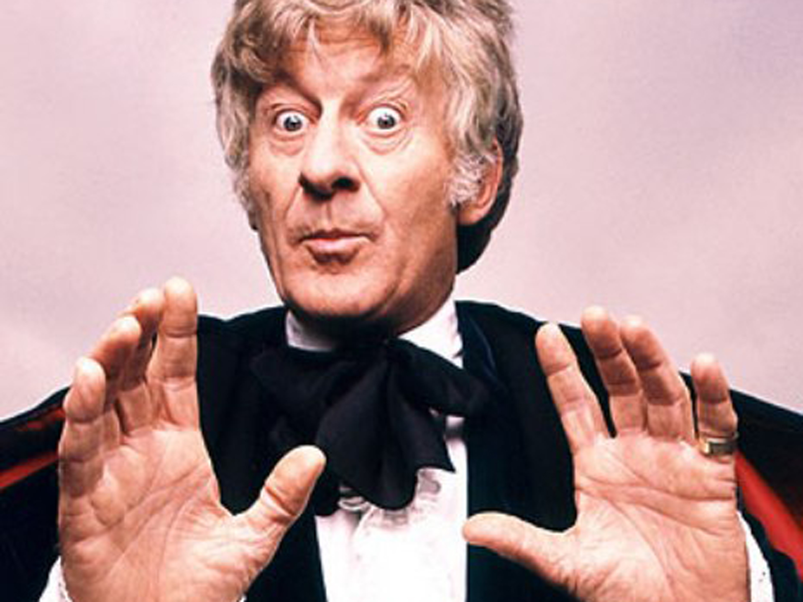
# [fit] Three
# [fit] Jon Pertwee
# [fit] 1970-1974
# [fit] the dandy
# [fit] "Reverse the polarity!"

^ 1st doctor in color, 1st doc with sonic screwdriver. He drove a car, Bessie, when he was trapped on earth. The second Doctor called him "Fancy Pants".

---

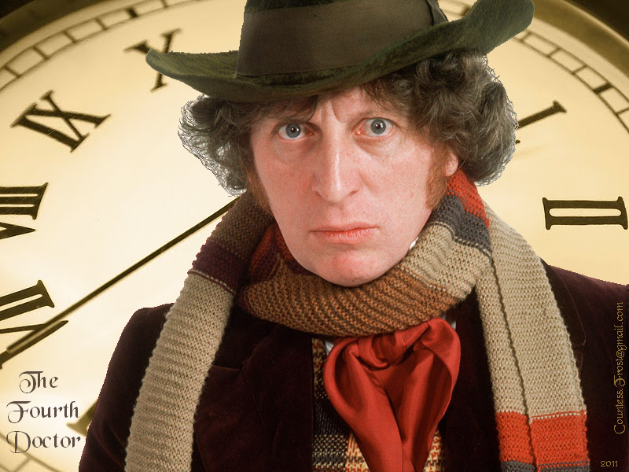
# [fit] Four
# [fit] Tom Baker
# [fit] 1974-1981
# [fit] the one with the scarf

^ The Doctor Americans met first. Lucky to be written by Douglas Adams. Beloved. Sarah Jane Smith.

---

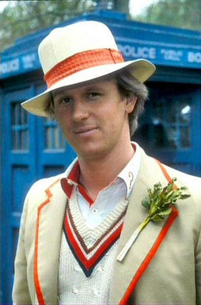
# [fit] Five
# [fit] Peter Davison
# [fit] 1981-1984
# [fit] the cute blond one

^ He played cricket & wore a stick of celery on his lapel. A fan favorite, got some great writing. Adric, Turlough.

---

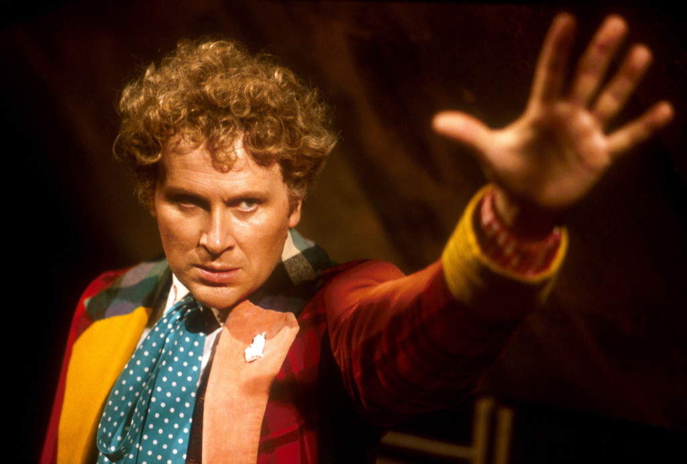
# [fit] Six
# [fit] Colin Baker
# [fit] 1984-186
# [fit] the one nobody likes

^ Bad writing and probably bad casting.

---

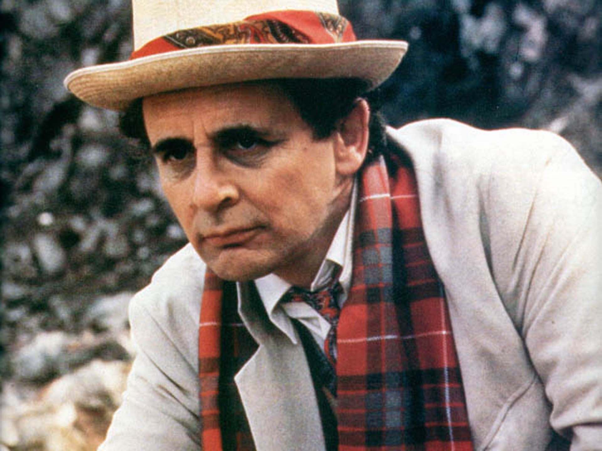
# [fit] Seven
## [fit] Sylvester McCoy
### [fit] 1987-1989
## [fit] chess player

^ Companion Ace. Erratic writing: "Curse of Fenric" is best classic Who script, but he mostly had terrible clunkers. Dark Doctor, manipulative & secretive. One of my favorites.

---

# [fit] Cancellation

^ Dark times. Kept alive in radio plays, called the audio adventures. 7 years.

---

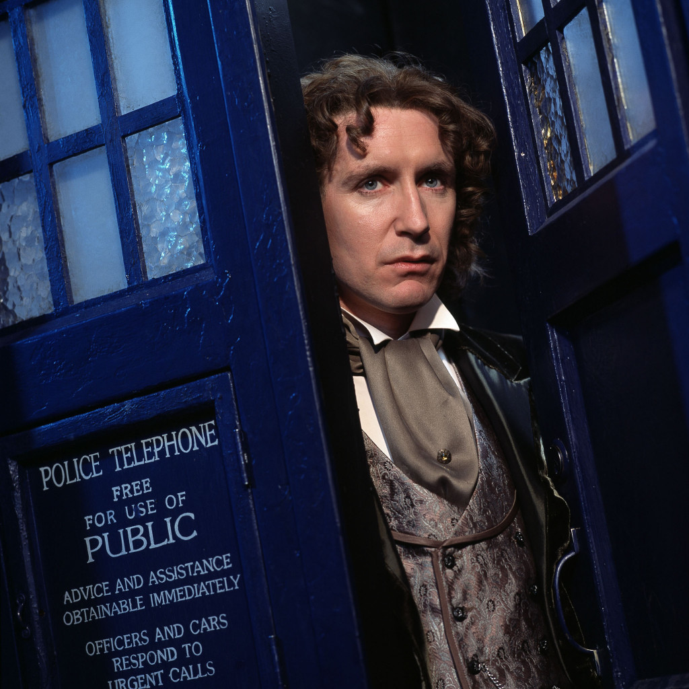
# [fit] Eight
# [fit] Paul McGann
# [fit] 1996
# [fit] the American Doctor

^ A TV movie, bizarrely set in San Francisco. Did not prompt an American reboot.

---

# [fit] Time passes

^ Nine years of no new Who, only audio adventures.

---

# [fit] 2005 reboot!

---

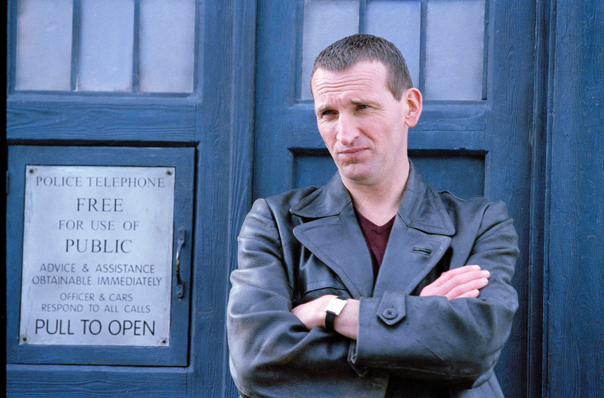
# [fit] Nine
# [fit] Christopher Eccleston
# [fit] 2005
# [fit] "Run!"

^ Ears & a leather jacket. The actor left the show suddenly. His time was too short. Companion: Rose.

---

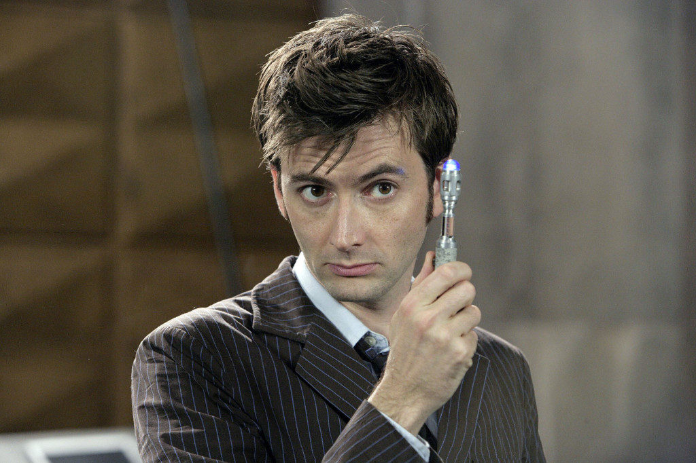
# [fit] Ten
# [fit] David Tennant
# [fit] 2005-2010
# [fit] "I'm so sorry."

^ Most beloved of the modern Doctors. "Blink": wibbley wobbley timey wimey stuff. Companions: Rose, Martha, Donna.

---

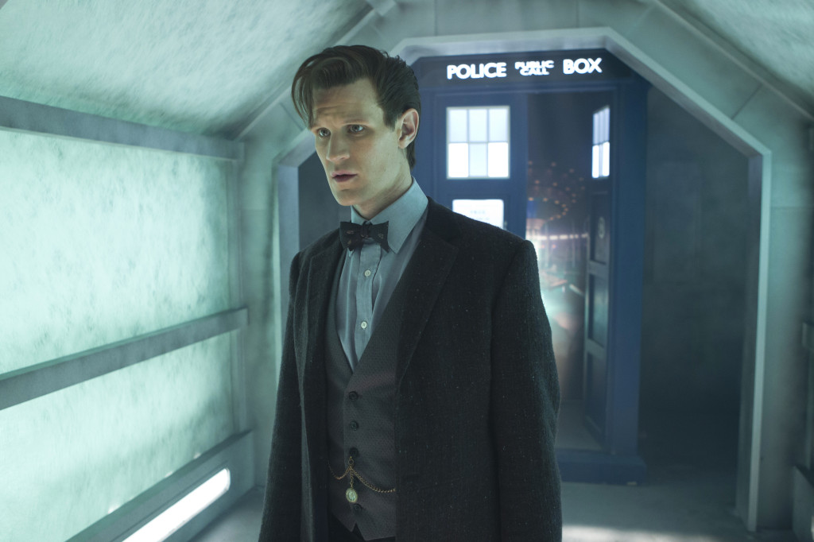
# [fit] Eleven
# [fit] Matt Smith
# [fit] 2010-2013
# [fit] "fezzes are cool"

^ Inspired by 2. Wore tweed & a bow tie. Youngest actor. Companions: Amy & Rory, his wife, Clara.

---

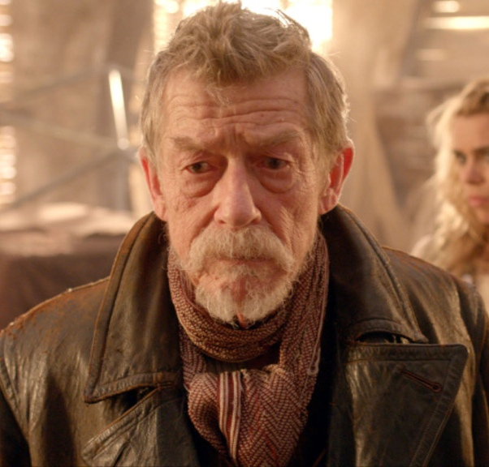
# [fit] The War Doctor
# [fit] John Hurt
# [fit] 2013
# [fit] One two-parter.

^ Yes, that John Hurt.

---

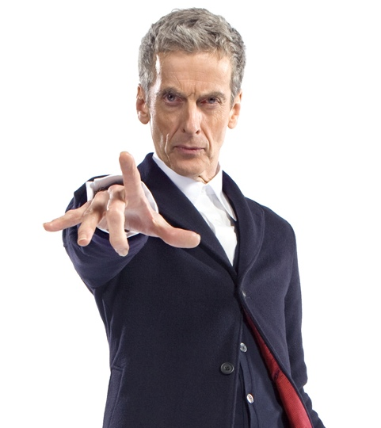

# [fit] Twelve
# [fit] Peter Capaldi
# [fit] 2014-
# [fit] Attack eyebrows

^ Back to the tradition of older Doctors played by strong actors. Inspired by Three.

---

# [fit] The Doctor changes.
# [fit] The companions change.
# [fit] Only the TARDIS remains.

^ 50 years from now, somebody called The Doctor will travel thru time & space in a TARDIS. That'll be the only similarity, but it'll still be Who.
