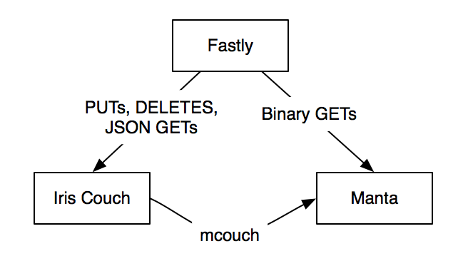
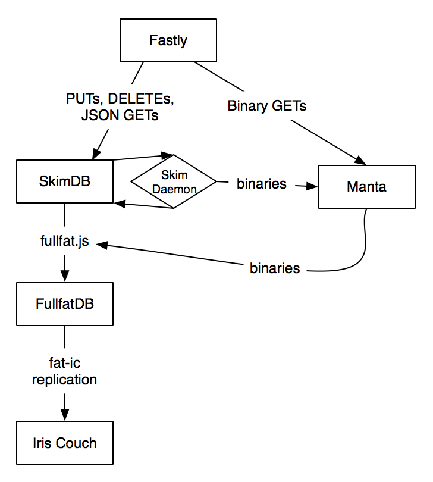
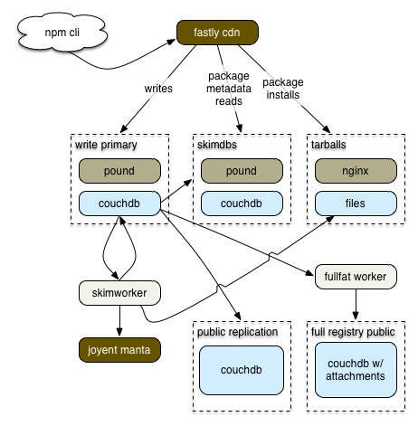
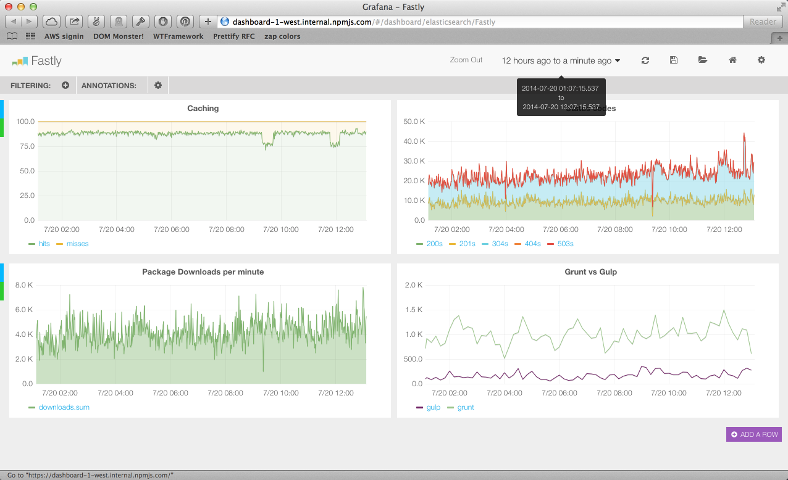
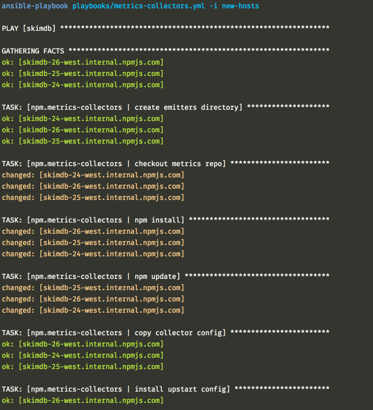

# [fit] stabilizing
# [fit] the registry

---

# [fit] C J Silverio
## [fit] devops at npmjs.com
## [fit] @ceejbot

^ I'm going to ignore the web site almost entirely in this presentation because a) I don't have time, and b) it's the most refreshingly boring part of our architecture.

---

# [fit] side project
# [fit] 100% couchdb
# [fit] donated hosting
# [fit] IrisCouch 

^ Starting point: it was Isaac Schlueter's side project. It was implemented as a couchdb application: the user auth was couchdb auth, all the logic was stored in couchdb & executed there. All the package tarballs were also stored in couchdb. The hosting story is typical: it was donated as an advertising thing back when there were a few hundred packages on it. This was awesome as long as it was working, which was a long time. Then this happened.

---

^ November 2013 was when the benign neglect finally caught up with the registry. This is when Nodejitsu ran the "scale npm" fundraiser. I'm still waiting for my t-shirt too, so don't ask me where they are. What you did get from that fundraiser that was worth it was that the registry was up at all during that month.

---

# [fit] December 2013

^ Step one: stop serving the tarballs from CouchDB. Put a CDN in front of everything.

---

# [fit] January 2013

^ This was more or less holding up under the load, though there were still outages with absolutely no visibility into why.

---

#  February 2014

* company founded & funded
* 100% hosted on Joyent
* several skimdbs load-balanced by Fastly
* hand-built CouchDB + Spidermonkey
* automation by bash
* Twitter tells us when we're down

^ The registry is no longer in emergency mode, but it's still suffering periodic downtime. We have a contractor in South Africa, Jacques Marneweck, who is doing fantastic work getting us functional on SmartOS.

---

# This is when I arrive.

(funding means you can hire!)

* PagerDuty account: first thing I did
* Nagios all hooked up & monitoring basic host health
* we have maybe 10 hosts total driving the registry

---

# [fit] Funding also means attention
# [fit] from bounty-hunters.

^ We had security breaches my first week on the job, from "white hats" in search of bounties. This led pretty directly to our next major outage. We replaced the registry cert but didn't choose one from a provider that old clients knew how to trust. There are a LOT of old clients out there, some of them un-upgradeable.

---

# [fit] security audit

^ Raquel Velez, our web engineer, got most of the work resulting from this, but we had to start firewalling.

---

# Stabilization stage 1

* monitor everything more deeply
* methodically identify & monitor causes of outages
* react quickly to fix problems
* Twitter is no longer telling us when we're down

---

# Stabilization stage 2

* our second devops person: Ben Coe
* recurring problems fixed in the apps
* monitoring checks self-heal
* monitoring looks ahead at trends
* redundancy everywhere
* automation!
* our night shift is bored!

---

# [fit] Superficially
# [fit] similar.

^ The registry July 2014. We are reliable now. We know when our providers are down before they do sometimes. Manta is now a backup store for us-- tarballs are served from a file system behind nginx. We have a write primary & a second replication primary, and a bunch of leaves that just read from the replication primary.

---

# major changes

100% on AWS
Ubuntu Trusty
70/30 split between us-west-2 & us-east-1
100% automated with ansible
52 running instances, variable

^ I'm like a dance DJ-- I made all these changes while matching beats. The new infrastructure would run alongside the old one. I'd fade the old one out & the new one in & registry users wouldn't notice the transition.

---

# the stack

* Fastly CDN  for Varnish cache & geolocality
* nginx to serve static files
* pound to terminate TLS
* CouchDB for package metadata & app logic
* nagios + PagerDuty for monitoring
* InfluxDB + Grafana for metrics
* Tarsnap for backups

^ We pay to have InfluxDB hosted.

---

^ Very happy with InfluxDB + Grafana combo.

---

^ Very happy with ansible: hosts are configured without being touched by human hands.

---

# weak points

* single points of failure: Fastly, write primary
* still looking for an off-AWS backup
* expensive to run: too many couchdbs
* too entangled with couchdb
* complex in odd places: the skimworker, for example

---

# [fit] I now praise
# [fit] CouchDB

^ It carried the registry a long long way all by itself before falling over. Its replication is rock-solid & is a building block of our architecture. It also publishes a reliable changes feed that is crucial to how we build our redundancy. Now that we're on Ubuntu it's reliable and easy to deploy. I like it, especially now that we're no longer making it do things it's bad at.

---

# [fit] my next goal:
# [fit] make it cheap

^ This is already in progress. In fact, the diagram I showed you of how the registry works today is how it worked on Sunday. It's different already, and I very much hope to talk to you all again in three months to tell you how I got us serving the registry on one dollar a day.

---

# [fit] my real goal:
# [fit] npm so reliable
# [fit] it's like a utility
